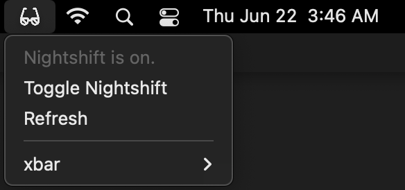

# xbar-low-power-mode-tool
A quick xbar tool to toggle MacOS Nightshift with less clicks.

## What's xbar?

[This is xbar!](https://xbarapp.com/)

## Important installation note

You need to install [Nightlight](https://github.com/smudge/nightlight) on your Mac first!

